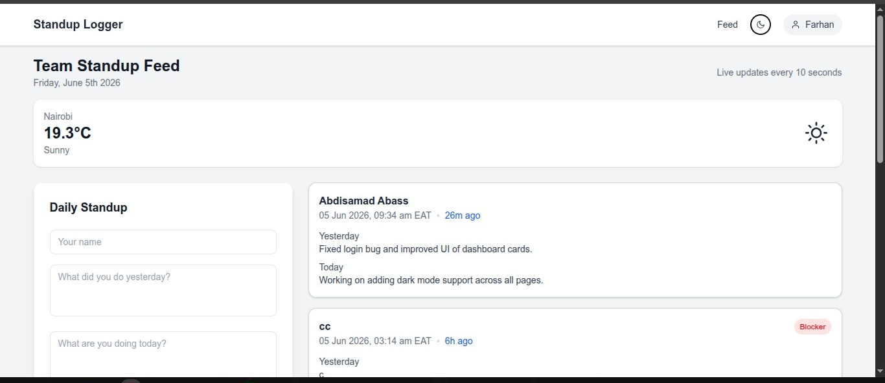
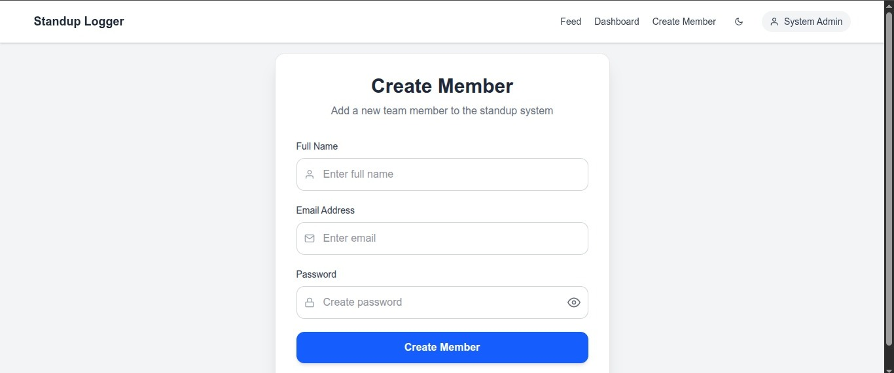

## 🚀 Standup Logger – Team Productivity Tool

A lightweight internal productivity tool that allows teams to post daily standup updates, track blockers, and monitor team performance in real time.

Built with **Flask (Backend)** and **React (Frontend)**.

---

## 🌐 Live Demo

### Frontend (Production)
**https://standup-logger-frontend.vercel.app/**

### Frontend Preview Deployments
**https://standup-logger-frontend-git-main-abdisamad-tawanes-projects.vercel.app/**

**https://standup-logger-frontend-3zimtz3tr-abdisamad-tawanes-projects.vercel.app/**

### Backend API
**https://standup-logger-backend-j3ep.onrender.com**

---

## 🏢 Project Overview

The Standup Logger replaces traditional daily standup meetings with an asynchronous web-based system where:

- Team members submit daily updates
- Managers monitor team health
- Blockers are tracked visually
- Activity is displayed in real-time (polling)
- Weather and time context is included per session

---

## ✨ Features

### 👤 Authentication & Roles

- Admin and Member login system
- Role-based routing and permissions
- Secure password hashing (bcrypt)

### 📝 Standup System

- Daily updates:
  - Yesterday work
  - Today work
  - Blockers
- File attachment support (PDF, DOCX, images, etc.)
- Cloudinary file storage

### 📡 Live Activity Feed

- Auto-refresh every 10 seconds
- No page reload required
- Displays all team updates in real time

### 📊 Productivity Dashboard

- Total posts
- Blocker count
- Team health score
- Average posts per day
- Charts:
  - Posts per day (7 days)
  - Blockers per day
  - Team activity per member

### 🌦️ Weather Integration

- Open-Meteo API (no API key required)
- Displays:
  - Temperature
  - Weather condition
  - Location: Nairobi

### 📎 File Management

- Upload attachments (PDF, DOCX, images, etc.)
- Secure download endpoint
- Preserves original filenames

---

## 🛠️ Tech Stack

### Backend

- Flask
- Flask-SQLAlchemy
- Flask-Bcrypt
- Flask-CORS
- PostgreSQL (Neon DB)
- Cloudinary (file storage)

### Frontend

- React (Vite)
- Axios
- Tailwind CSS
- Recharts (charts)
- React Hot Toast
- React Icons

---

## 📁 Project Structure

### Backend

```bash
backend/
│── app.py
│── config.py
│── models.py
│── extensions.py
│── requirements.txt
│── .env
│── routes/
│   ├── auth.py
│   └── standups.py
│── utils/
│   └── stats.py
```

### Frontend

```bash
frontend/
│── src/
│   ├── api/
│   ├── components/
│   ├── context/
│   ├── hooks/
│   ├── layouts/
│   ├── pages/
│   ├── routes/
│   └── utils/
│── public/
│── package.json
│── vite.config.js
│── vercel.json
│── .env
```

---

## 🚀 Setup Instructions

### 1️⃣ Backend Setup

#### Install dependencies

```bash
cd backend
pip install -r requirements.txt
```

#### ⚙️ Configure environment variables

Create a `.env` file in the backend folder:

```env
DATABASE_URL=your_postgres_url
FLASK_ENV=development

ADMIN_EMAIL=admin@standup.com
ADMIN_PASSWORD=Admin12345
ADMIN_NAME=System Admin

CLOUDINARY_CLOUD_NAME=your_cloud
CLOUDINARY_API_KEY=your_key
CLOUDINARY_API_SECRET=your_secret
```

#### ▶️ Run backend server

```bash
python app.py
```

#### 🌐 Backend URL

```
http://127.0.0.1:10000
```

---

### 2️⃣ Frontend Setup (React)

#### 📦 Install dependencies

```bash
cd frontend
npm install
```

#### ⚙️ Configure environment variables

Create a `.env` file in the frontend folder:

```env
VITE_API_URL=http://127.0.0.1:10000
```

#### ▶️ Run frontend server

```bash
npm run dev
```

#### 🌐 Frontend URL

```
http://localhost:5173
```

---

## 🔌 API Endpoints

### 🔐 Authentication

- `POST /auth/login`
- `POST /auth/create-user`

### 📝 Standups

- `GET /standups/`
- `POST /standups/`
- `GET /standups/stats/`
- `GET /standups/download/<id>`

---

## 📊 Dashboard Metrics

The system tracks:

- Total posts created
- Total blockers reported
- Team health percentage
- Average posts per day
- Individual team contribution

---

## 🌦️ Weather API Integration

The application integrates with the Open-Meteo Weather API to display real-time weather information for Nairobi, Kenya.

### API Endpoint Used

```http
https://api.open-meteo.com/v1/forecast?latitude=-1.286389&longitude=36.817223&current=temperature_2m,weather_code
```

### Weather Features

- Real-time temperature display
- Weather condition mapping (Sunny, Cloudy, Rainy, etc.)
- Nairobi, Kenya location data
- No API key required
- Lightweight and fast public weather service

### Example Response

```json
{
  "current": {
    "temperature_2m": 23.4,
    "weather_code": 1,
    "time": "2026-06-08T10:00"
  }
}
```

---

## 📸 Screenshots

### 🔐 Login Page


### 📡 Live Feed



### 📊 Dashboard


### 👤 Create Member (Admin Only)



---

## 🚀 Deployment

- **Backend:** Render
- **Frontend:** Vercel

### ⚙️ Important

Update frontend environment variable for production:

```env
VITE_API_URL=https://your-backend-url
```

---

## 🔐 Security Notes

This project implements basic security best practices:

- Passwords are securely hashed using **bcrypt**
- Role-based access control (Admin / Member)
- Admin account creation restricted via environment variables
- Cross-Origin Resource Sharing (CORS) enabled for secure frontend communication

---

## 👨‍💻 Author

Abdisamad Abass

Built as an Internship Assignment – Konvergenz Network Solutions Ltd.

